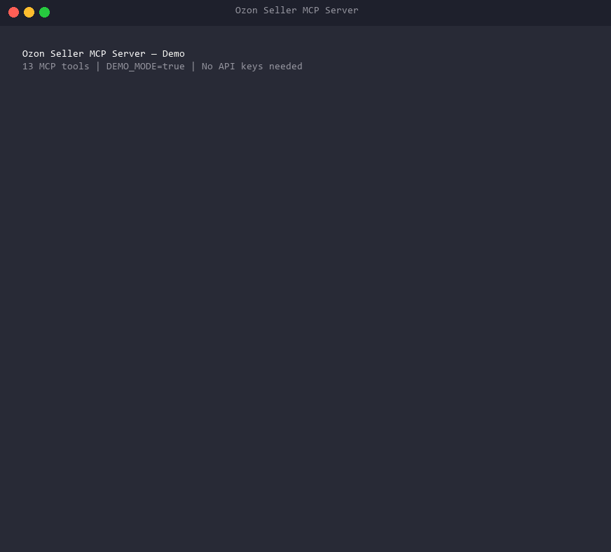

# Ozon Seller MCP Server

> **The first Model Context Protocol server for Ozon Seller API** — enabling AI assistants like Claude and Cursor to manage products, orders, pricing, and analytics on Russia's largest e-commerce marketplace.

[](https://github.com/MASTER116/ozon-mcp-server/actions/workflows/ci.yml)
[](https://www.python.org/downloads/)
[](LICENSE)
[](https://modelcontextprotocol.io/)
[](https://github.com/PyCQA/bandit)
[](https://github.com/astral-sh/ruff)

[English](README.md) | [Русский](README.ru.md)



---

## Why This Project

**[Ozon](https://www.ozon.ru)** is Russia's largest e-commerce marketplace (comparable to Amazon) — NASDAQ-listed (OZON), 50M+ active buyers, 600B+ RUB annual GMV. Thousands of sellers rely on the Ozon Seller API for inventory, pricing, and order management.

**No MCP server existed for Ozon.** This project fills that gap — enabling AI assistants to directly manage Ozon seller operations through the standardized [Model Context Protocol](https://modelcontextprotocol.io/).

**Why it matters:** This is a production-grade integration bridging Russian e-commerce infrastructure with the global AI tooling ecosystem, demonstrating security-first API design, async Python architecture, and full OWASP MCP Top 10 compliance.

---

## Architecture

```mermaid
flowchart TB
    subgraph MCP Clients
        A[Claude Desktop]
        B[Cursor IDE]
        C[Custom Client]
    end

    subgraph MCP Server
        D[FastMCP 2.x<br/>Streamable HTTP / stdio]
        E[Bearer Auth]
        F[Rate Limiter<br/>Token Bucket]
        G[Circuit Breaker]
        H[Input Validation<br/>Pydantic v2]
        I[Audit Logger]
    end

    subgraph Tools — 13 MCP Tools
        J[Products<br/>list · info · create · archive · stocks]
        K[Orders<br/>FBS · FBO]
        L[Analytics<br/>sales · finance]
        M[Warehouses<br/>list]
        N[Pricing<br/>update prices · update stocks]
    end

    subgraph Infrastructure
        O[(PostgreSQL<br/>Audit Logs)]
        P[(Redis<br/>Cache + Rate Limits)]
    end

    Q[Ozon Seller API<br/>api-seller.ozon.ru]

    A & B & C -->|MCP Protocol| D
    D --> E --> F --> G --> H --> I
    I --> J & K & L & M & N
    J & K & L & M & N --> Q
    I --> O
    F --> P
    J & K & L & M & N -.->|cache| P
```

---

## Key Features

- **13 MCP Tools** — Product CRUD, order tracking (FBS/FBO), sales analytics, financial reports, warehouse management, bulk pricing and stock updates
- **6-Layer Security Architecture** — SSRF prevention, input validation, credential masking, rate limiting, audit logging, circuit breaker
- **OWASP MCP Top 10 Compliance** — Every risk from the [OWASP MCP Top 10 (v0.1)](https://owasp.org/www-project-mcp-top-10/) is addressed
- **Redis Caching** — Category-based cache with configurable TTL, automatic invalidation on write operations
- **PostgreSQL Audit Log** — Every tool invocation logged with parameters, response time, and Ozon trace ID
- **Circuit Breaker** — Automatic Ozon API cutoff after consecutive failures, with recovery probing
- **Production Docker Setup** — Multi-stage build, non-root user, read-only filesystem, health checks

---

## Quick Start

```bash
# Clone the repository
git clone https://github.com/MASTER116/ozon-mcp-server.git
cd ozon-mcp-server

# Configure environment
cp .env.example .env
# Edit .env — set OZON_CLIENT_ID, OZON_API_KEY (from seller dashboard)
# and POSTGRES_PASSWORD (required, no default)

# Start with Docker Compose (includes Redis + PostgreSQL)
docker compose up -d

# Or run locally with uv
uv sync --dev
uv run python -m ozon_mcp_server
```

> **Note:** No passwords or secrets are stored in the repository. All credentials must be provided via `.env` file (which is in `.gitignore` and never committed).

### Demo Mode (no Ozon API keys needed)

Try all 13 tools with realistic mock data — no Ozon seller account, Redis, or PostgreSQL required:

```bash
DEMO_MODE=true uv run python -m ozon_mcp_server
```

Demo includes 5 products (AirPods, Dyson, JBL, Nike, Samsonite), 4 orders across 4 cities, 3 warehouses, sales analytics (2.1M RUB / 150 orders), and financial reports.

### Claude Desktop Configuration

Add to your `claude_desktop_config.json`:

```json
{
  "mcpServers": {
    "ozon": {
      "command": "docker",
      "args": ["compose", "-f", "/path/to/ozon-mcp-server/docker-compose.yml", "run", "--rm", "ozon-mcp"],
      "env": {
        "OZON_CLIENT_ID": "your-client-id",
        "OZON_API_KEY": "your-api-key"
      }
    }
  }
}
```

---

## Available Tools

| Tool | Type | Description | Ozon API Endpoint |
|------|------|-------------|-------------------|
| `get_product_list` | Read | List products with pagination and visibility filter | `/v2/product/list` |
| `get_product_info` | Read | Get detailed product info by ID, SKU, or offer_id | `/v2/product/info` |
| `get_stock_on_warehouses` | Read | Get stock levels across all warehouses | `/v1/product/info/stocks` |
| `create_product` | Write | Create a new product listing | `/v3/product/import` |
| `update_prices` | Write | Bulk update product prices | `/v1/product/import/prices` |
| `update_stocks` | Write | Bulk update stock quantities | `/v2/products/stocks` |
| `archive_product` | Write | Archive products (remove from listings) | `/v1/product/archive` |
| `get_fbs_orders` | Read | List FBS orders (Fulfillment by Seller ≈ FBM) | `/v3/posting/fbs/list` |
| `get_fbo_orders` | Read | List FBO orders (Fulfillment by Ozon ≈ FBA) | `/v2/posting/fbo/list` |
| `get_analytics` | Read | Sales analytics (revenue, orders, views, conversions) | `/v1/analytics/data` |
| `get_finance_report` | Read | Financial transactions (commissions, penalties) | `/v3/finance/transaction/list` |
| `get_warehouse_list` | Read | List all seller warehouses | `/v1/warehouse/list` |

Write tools are annotated with `destructiveHint: true` — MCP clients like Claude Desktop will prompt for confirmation before executing them.

---

## Security

Security is a first-class citizen, following the **OWASP MCP Top 10** framework:

| Layer | Protection | Implementation |
|-------|-----------|----------------|
| **Authentication** | Bearer token with constant-time comparison | `middleware/auth.py` |
| **SSRF Prevention** | Hardcoded base URL, private IP blocking, redirect prohibition | `api/client.py` |
| **Input Validation** | Strict Pydantic v2 schemas, allowlists, length limits | `models/*.py` |
| **Rate Limiting** | Redis Token Bucket — global, per-write, per-session | `middleware/rate_limit.py` |
| **Credential Masking** | `SecretStr` for all secrets, regex output sanitization | `middleware/security.py` |
| **Audit Logging** | Every tool call logged to PostgreSQL with masked parameters | `db/audit_repo.py` |
| **Circuit Breaker** | Auto-cutoff after 5 consecutive Ozon API failures | `api/client.py` |

See [SECURITY.md](SECURITY.md) for the full threat model and vulnerability reporting policy.

---

## Architecture Decisions

| Decision | Choice | Rationale |
|----------|--------|-----------|
| MCP Framework | FastMCP 2.x | Most popular MCP framework, built-in tool annotations, 23K+ GitHub stars |
| HTTP Client | httpx | Native async, HTTP/2, timeouts, retry — idiomatic choice for Python |
| Caching | Redis | Sub-millisecond latency, Token Bucket for rate limiting, TTL support |
| Audit Storage | PostgreSQL | ACID compliance, JSONB for parameters, indexed for performance |
| Validation | Pydantic v2 | Strict mode, automatic JSON Schema generation for FastMCP |
| Not FastAPI | FastMCP native | MCP server is not a REST API; FastMCP provides native transport |
| Python 3.12 | Latest stable | Pattern matching, performance improvements, modern typing |

---

## Tech Stack

`Python 3.12` · `FastMCP` · `httpx` · `Pydantic v2` · `asyncpg` · `Redis` · `PostgreSQL` · `Docker` · `GitHub Actions` · `structlog` · `tenacity`

---

## Production Deployment

```bash
# 1. Copy and fill production config
cp .env.production.example .env

# Generate strong passwords:
#   openssl rand -base64 32   (for POSTGRES_PASSWORD, REDIS_PASSWORD)
#   openssl rand -hex 32      (for MCP_AUTH_TOKEN)

# 2. Start all services
docker compose -f docker-compose.prod.yml up -d

# 3. Check health
docker compose -f docker-compose.prod.yml ps
docker compose -f docker-compose.prod.yml logs ozon-mcp

# 4. Run database backup (manual)
docker compose -f docker-compose.prod.yml --profile maintenance run --rm pg-backup

# 5. Run audit cleanup (manual)
docker compose -f docker-compose.prod.yml --profile maintenance run --rm audit-cleanup
```

**Production security** (vs dev docker-compose):
- **Zero hardcoded passwords** — all secrets via `.env` (never committed to git)
- **Redis**: `requirepass` + `CONFIG`, `KEYS`, `FLUSHDB`, `FLUSHALL`, `DEBUG` disabled
- **PostgreSQL**: `scram-sha-256` auth + init script with indexes
- **Network isolation** — MCP port on `127.0.0.1` only, DB/Redis on internal network
- **Container hardening** — `cap_drop: ALL`, `no-new-privileges`, `read_only` filesystem
- **Resource limits** (CPU + memory) per container
- **Log rotation** (json-file driver with max-size)
- **Audit cleanup** (90-day retention) and **PostgreSQL backups** (maintenance profile)

See [SECURITY.md](SECURITY.md) for the full production hardening checklist.

---

## Testing

**157 tests** with **83% code coverage** (threshold: 80%):

```bash
uv run pytest -v
```

| Test Suite | Tests | Covers |
|------------|-------|--------|
| Security (SSRF, injection, credentials) | 20 | `api/client.py`, `middleware/*`, `models/*` |
| Product tools (list, info, stocks, prices, create, archive) | 19 | `tools/product_tools.py` — 98% |
| Order tools (FBS, FBO, analytics, finance, warehouses) | 14 | `tools/order_tools.py` — 100% |
| Model validation (products, orders, common) | 40 | `models/*` — 93–100% |
| API client (SSRF, circuit breaker, errors) | 9 | `api/client.py` |
| Cache (Redis get/set/invalidate) | 7 | `cache/redis_cache.py` |
| Middleware (auth, rate limit, security) | 17 | `middleware/*` — 81–100% |
| Server (AppContext, MCP instance, resources) | 5 | `server.py` |

All external dependencies (Redis, PostgreSQL, Ozon API) are fully mocked — no infrastructure required to run tests.

---

## Development

```bash
# Install dependencies
uv sync --dev

# Run linting
uv run ruff check src/ tests/
uv run ruff format --check src/ tests/

# Type checking
uv run mypy src/

# Security scanning
uv run bandit -r src/ -c pyproject.toml
uv run pip-audit

# Run tests with coverage
uv run pytest -v

# Pre-commit hooks
uv run pre-commit install
```

See [CONTRIBUTING.md](CONTRIBUTING.md) for the full development guide.

---

## License

[MIT](LICENSE) — Азат Халяфиев (Azat Khaliafiev)
