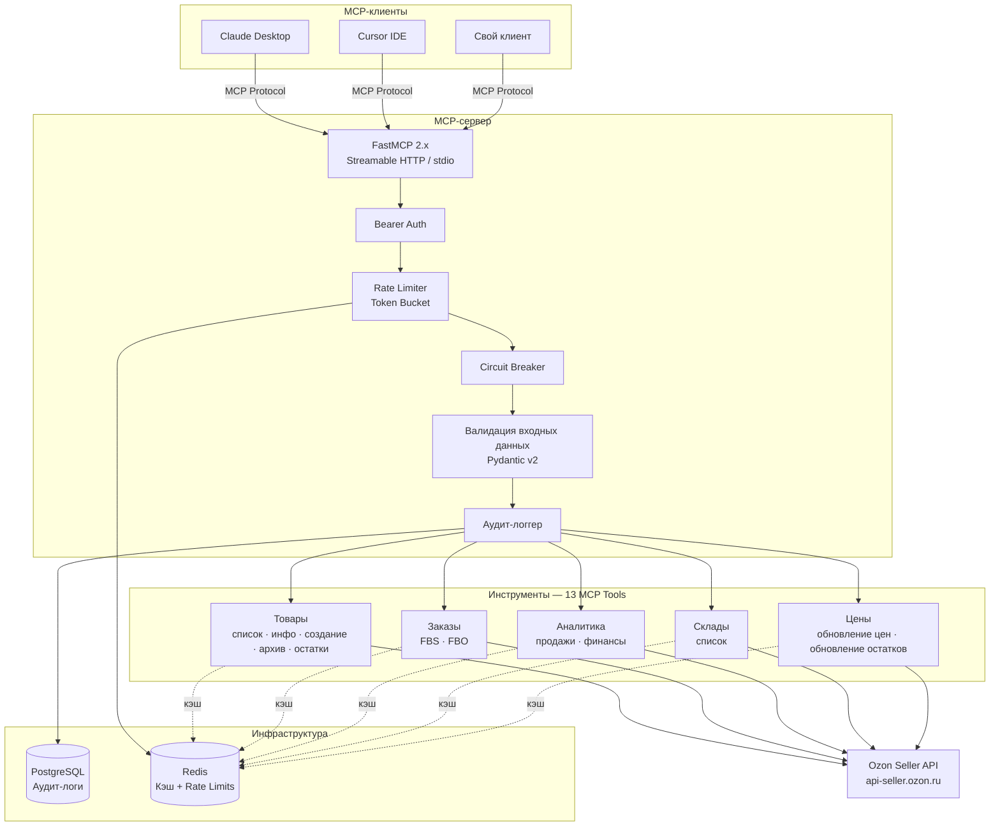

# Ozon Seller MCP Server

> **Первый MCP-сервер для Ozon Seller API** — позволяет AI-ассистентам (Claude, Cursor) управлять товарами, заказами, ценами и аналитикой на крупнейшем маркетплейсе России.

[](https://github.com/MASTER116/ozon-mcp-server/actions/workflows/ci.yml)
[](https://www.python.org/downloads/)
[](LICENSE)
[](https://modelcontextprotocol.io/)
[](https://github.com/PyCQA/bandit)
[](https://github.com/astral-sh/ruff)

[English](README.md) | [Русский](README.ru.md)

---

## Зачем этот проект

**[Ozon](https://www.ozon.ru)** — крупнейший маркетплейс России (аналог Amazon). Листинг на NASDAQ (OZON), 50M+ активных покупателей, 600B+ руб. годового GMV. Тысячи продавцов используют Ozon Seller API для управления ассортиментом, ценами и заказами.

**MCP-сервера для Ozon не существовало.** Этот проект заполняет пробел — AI-ассистенты получают прямой доступ к операциям продавца через стандартизированный [Model Context Protocol](https://modelcontextprotocol.io/).

**Почему это важно:** Production-grade интеграция, связывающая инфраструктуру российской электронной коммерции с глобальной экосистемой AI-инструментов. Security-first дизайн API, асинхронная Python-архитектура и полное соответствие OWASP MCP Top 10.

---

## Архитектура



---

## Ключевые возможности

- **13 MCP-инструментов** — CRUD товаров, отслеживание заказов (FBS/FBO), аналитика продаж, финансовые отчёты, управление складами, массовое обновление цен и остатков
- **6-уровневая архитектура безопасности** — защита от SSRF, валидация входных данных, маскирование секретов, rate limiting, аудит-логирование, circuit breaker
- **Соответствие OWASP MCP Top 10** — учтён каждый риск из [OWASP MCP Top 10 (v0.1)](https://owasp.org/www-project-mcp-top-10/)
- **Кэширование Redis** — категорийный кэш с настраиваемым TTL, автоматическая инвалидация при записи
- **Аудит-лог PostgreSQL** — каждый вызов инструмента логируется с параметрами, временем ответа и Ozon trace ID
- **Circuit Breaker** — автоматическое отключение Ozon API после серии сбоев с зондированием восстановления
- **Production Docker** — многоэтапная сборка, непривилегированный пользователь, read-only файловая система, health checks

---

## Быстрый старт

```bash
# Клонирование репозитория
git clone https://github.com/MASTER116/ozon-mcp-server.git
cd ozon-mcp-server

# Настройка окружения
cp .env.example .env
# Отредактируйте .env — укажите Client-Id и Api-Key из кабинета продавца Ozon

# Запуск через Docker Compose (включает Redis + PostgreSQL)
docker compose up -d

# Или локальный запуск через uv
uv sync --dev
uv run python -m ozon_mcp_server
```

### Настройка Claude Desktop

Добавьте в `claude_desktop_config.json`:

```json
{
  "mcpServers": {
    "ozon": {
      "command": "docker",
      "args": ["compose", "-f", "/path/to/ozon-mcp-server/docker-compose.yml", "run", "--rm", "ozon-mcp"],
      "env": {
        "OZON_CLIENT_ID": "ваш-client-id",
        "OZON_API_KEY": "ваш-api-key"
      }
    }
  }
}
```

---

## Доступные инструменты

| Инструмент | Тип | Описание | Эндпоинт Ozon API |
|------------|-----|----------|-------------------|
| `get_product_list` | Чтение | Список товаров с пагинацией и фильтром видимости | `/v2/product/list` |
| `get_product_info` | Чтение | Подробная информация о товаре по ID, SKU или offer_id | `/v2/product/info` |
| `get_stock_on_warehouses` | Чтение | Остатки на всех складах | `/v1/product/info/stocks` |
| `create_product` | Запись | Создание нового товара | `/v3/product/import` |
| `update_prices` | Запись | Массовое обновление цен | `/v1/product/import/prices` |
| `update_stocks` | Запись | Массовое обновление остатков | `/v2/products/stocks` |
| `archive_product` | Запись | Архивация товаров (снятие с продажи) | `/v1/product/archive` |
| `get_fbs_orders` | Чтение | Заказы FBS (отгрузка продавцом, аналог FBM) | `/v3/posting/fbs/list` |
| `get_fbo_orders` | Чтение | Заказы FBO (отгрузка со склада Ozon, аналог FBA) | `/v2/posting/fbo/list` |
| `get_analytics` | Чтение | Аналитика продаж (выручка, заказы, просмотры, конверсия) | `/v1/analytics/data` |
| `get_finance_report` | Чтение | Финансовые операции (комиссии, штрафы) | `/v3/finance/transaction/list` |
| `get_warehouse_list` | Чтение | Список всех складов продавца | `/v1/warehouse/list` |

Инструменты записи помечены `destructiveHint: true` — MCP-клиенты (например, Claude Desktop) запрашивают подтверждение перед их выполнением.

---

## Безопасность

Безопасность — приоритет первого порядка, реализация по фреймворку **OWASP MCP Top 10**:

| Уровень | Защита | Реализация |
|---------|--------|------------|
| **Аутентификация** | Bearer-токен с constant-time сравнением | `middleware/auth.py` |
| **Защита от SSRF** | Захардкоженный base URL, блокировка приватных IP, запрет редиректов | `api/client.py` |
| **Валидация входных данных** | Строгие Pydantic v2 схемы, allowlist-ы, ограничения длины | `models/*.py` |
| **Rate Limiting** | Redis Token Bucket — глобальный, по записи, по сессии | `middleware/rate_limit.py` |
| **Маскирование секретов** | `SecretStr` для всех секретов, regex-санитизация вывода | `middleware/security.py` |
| **Аудит-логирование** | Каждый вызов в PostgreSQL с замаскированными параметрами | `db/audit_repo.py` |
| **Circuit Breaker** | Автоотключение после 5 подряд ошибок Ozon API | `api/client.py` |

Подробнее: [SECURITY.md](SECURITY.md) — модель угроз и политика отчётности об уязвимостях.

---

## Архитектурные решения

| Решение | Выбор | Обоснование |
|---------|-------|-------------|
| MCP-фреймворк | FastMCP 2.x | Самый популярный MCP-фреймворк, встроенные аннотации инструментов, 23K+ звёзд на GitHub |
| HTTP-клиент | httpx | Нативный async, HTTP/2, таймауты, retry — идиоматичный выбор для Python |
| Кэширование | Redis | Субмиллисекундная задержка, Token Bucket для rate limiting, поддержка TTL |
| Хранение аудита | PostgreSQL | ACID-совместимость, JSONB для параметров, индексы для производительности |
| Валидация | Pydantic v2 | Strict mode, автогенерация JSON Schema для FastMCP |
| Не FastAPI | FastMCP native | MCP-сервер — не REST API; FastMCP предоставляет нативный транспорт |
| Python 3.12 | Последний стабильный | Pattern matching, улучшения производительности, современная типизация |

---

## Стек технологий

`Python 3.12` · `FastMCP` · `httpx` · `Pydantic v2` · `asyncpg` · `Redis` · `PostgreSQL` · `Docker` · `GitHub Actions` · `structlog` · `tenacity`

---

## Тестирование

**157 тестов** с покрытием **83%** (порог: 80%):

```bash
uv run pytest -v
```

| Набор тестов | Кол-во | Покрывает |
|-------------|--------|-----------|
| Безопасность (SSRF, инъекции, утечка секретов) | 20 | `api/client.py`, `middleware/*`, `models/*` |
| Инструменты товаров (список, инфо, остатки, цены, создание, архив) | 19 | `tools/product_tools.py` — 98% |
| Инструменты заказов (FBS, FBO, аналитика, финансы, склады) | 14 | `tools/order_tools.py` — 100% |
| Валидация моделей (товары, заказы, общие) | 40 | `models/*` — 93–100% |
| API-клиент (SSRF, circuit breaker, ошибки) | 9 | `api/client.py` |
| Кэш (Redis get/set/invalidate) | 7 | `cache/redis_cache.py` |
| Middleware (аутентификация, rate limit, безопасность) | 17 | `middleware/*` — 81–100% |
| Сервер (AppContext, MCP-инстанс, ресурсы) | 5 | `server.py` |

Все внешние зависимости (Redis, PostgreSQL, Ozon API) полностью замоканы — для запуска тестов инфраструктура не нужна.

---

## Разработка

```bash
# Установка зависимостей
uv sync --dev

# Линтинг
uv run ruff check src/ tests/
uv run ruff format --check src/ tests/

# Проверка типов
uv run mypy src/

# Сканирование безопасности
uv run bandit -r src/ -c pyproject.toml
uv run pip-audit

# Запуск тестов с покрытием
uv run pytest -v

# Pre-commit хуки
uv run pre-commit install
```

Подробнее: [CONTRIBUTING.md](CONTRIBUTING.md) — полное руководство для разработчиков.

---

## Лицензия

[MIT](LICENSE) — Азат Халяфиев (Azat Khaliafiev)
